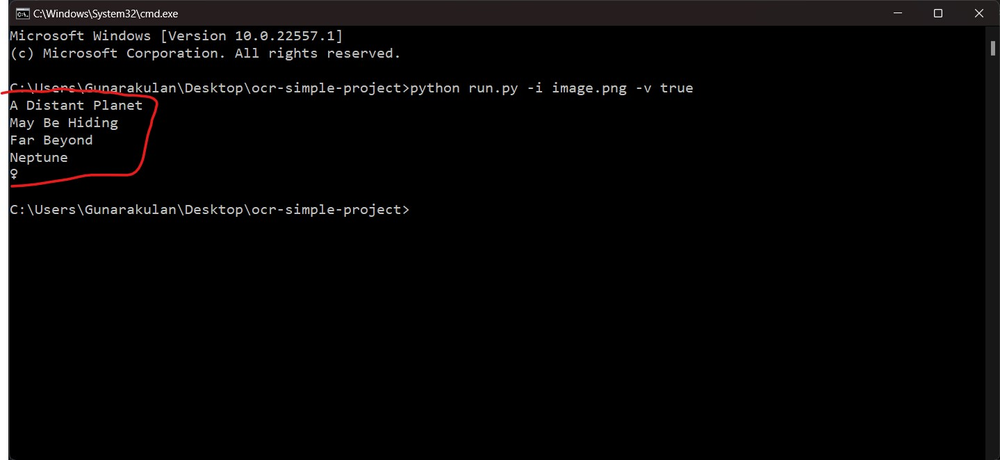

# OCR Images With Voice Outputs


## Introduction

This tool is used to perform OCR on images, and then return them as text and voice outputs.

OCR (optical character recognition) is the use of technology to distinguish printed or handwritten text characters inside digital images of physical documents, such as a scanned paper document. The basic process of OCR involves examining the text of a document and translating the characters into code that can be used for data processing. OCR is sometimes also referred to as text recognition.


## Technologies

- Python 3.8
- Argparse
- Pytesseract
- Pillow

### Why Argparse?

The argparse module makes it easy to write user-friendly command-line interfaces. The program defines what arguments it requires, and argparse will figure out how to parse those out of sys.argv. The argparse module also automatically generates help and usage messages and issues errors when users give the program invalid arguments.

**Note:** This program takes two parameters, "image" and "voice", these parameters determine the image path and voice outputs.

### Why Pytesseract?

Tesseract is an optical character recognition engine for various operating systems. It is free software, released under the Apache License. Originally developed by Hewlett-Packard as proprietary software in the 1980s, it was released as open source in 2005 and development has been sponsored by Google since 2006.


**Note:** We use this framework to perform the OCR task.

### Why Pillow?

The Python Imaging Library adds image processing capabilities to your Python interpreter.

This library provides extensive file format support, an efficient internal representation, and fairly powerful image processing capabilities.

The core image library is designed for fast access to data stored in a few basic pixel formats. It should provide a solid foundation for a general image processing tool.

## Configuration and Setup


- Installing Argparse

    ```python
    pip install argparse
    ```

- Installing Pytesseract

    ```python
    pip install pytesseract
    ```

- Installing Pillow

    ```python
    pip install pillow
    ```

### Install Tesseract OCR Engine

- Install Tesseract Engine on Windows: https://github.com/UB-Mannheim/tesseract/wiki

- Install Tesseract Engine on Linux: https://linuxhint.com/install-tesseract-ocr-linux/

## Execution and Running

- To run this app with voice output

    ```python
      python run.py -i image.png -v true
    ```

- To run this app without voice output

  ```python
    python run.py -i image.png -v false
  ```


## Demo and Output

### Testing Image


### Output



# Contact

### 🌐 Website:
[](https://www.mpowerr.com)

---

### 📱 Social Media:

[](https://www.linkedin.com/company/mpowerr-info)
[](https://www.facebook.com/mpowerr.info)
[](https://www.instagram.com/mpowerr.info)
[](https://x.com/MpowerrInfo)
[](https://www.tiktok.com/@mpowerr.info)
[](https://www.youtube.com/@mpowerrinfo)

---
